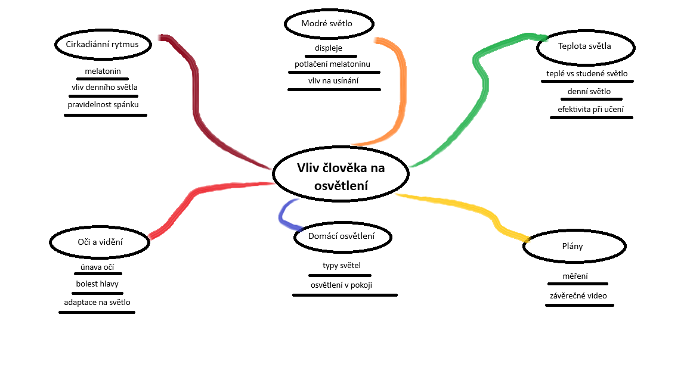
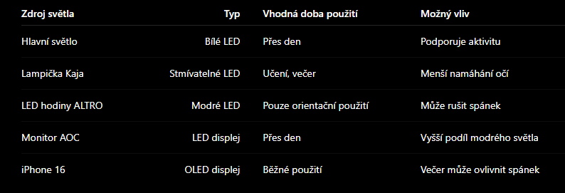

# Vliv osvětlení na člověka v domácnosti
## Úvod a cíl projektu

Téma vlivu osvětlení na člověka jsem si vybral proto, že světlo používáme každý den, ale většina lidí ve skutečnosti vůbec netuší, jak zásadně ovlivňuje náš organismus, psychiku, spánek i celkovou pohodu. V domácím prostředí často trávíme většinu dne, zvlášť pokud se učíme u počítače nebo pracujeme u stolu, a nevhodně zvolené světlo může způsobovat únavu očí, bolest hlavy, horší usínání nebo zhoršení soustředění. Zároveň se dnes velmi často mluví o modrém světle z displejů, o tom, jak potlačuje melatonin, a jak může ovlivňovat spánkový rytmus. Proto mi téma připadá užitečné, zajímavé a zároveň praktické do běžného života.

Cílem projektu je zjistit, jak různé druhy světla působí na člověka z hlediska spánku, cirkadiánního rytmu, únava očí a celkové pohody. V prvním pololetí se zaměřuji na teoretickou část – na shromáždění informací, popis současného stavu poznání, vysvětlení základních pojmů, vypsání světel v mém pokoji a zpracování dokumentace. Druhé pololetí bude věnováno praktické části projektu, kde natočím video, ve kterém vysvětlím podstatné závěry, shrnu, co jsem zjistil, a doplním potřebné materiály. V této fázi tedy vytvářím základ celého projektu, na kterém budu později stavět.

## Současný stav poznání

### Cirkadiánní rytmus a světlo

Osvětlení má na člověka mnohem větší vliv, než se na první pohled zdá. Z hlediska biologie hraje klíčovou roli cirkadiánní rytmus, tedy přirozený 24hodinový cyklus, který řídí spánek, bdělost, tělesnou aktivitu nebo tvorbu hormonů. Tento rytmus je silně ovlivňován světlem, zejména jeho intenzitou a barvou. Denní světlo pomáhá udržovat tělo v aktivním režimu, zatímco nedostatek světla nebo teplé tlumené světlo signalizuje organismu, že se blíží doba spánku. Pokud je tento rytmus narušen, může docházet k problémům se spánkem, únavě nebo snížené koncentraci.

### Modré světlo a melatonin

Velkou roli v ovlivnění spánku hraje modré světlo. To je přirozeně obsažené v denním světle, ale moderní elektronická zařízení, jako jsou monitory nebo mobilní telefony, ho vyzařují ve vysokém množství i ve večerních hodinách. Modré světlo potlačuje tvorbu hormonu melatoninu, který je zodpovědný za pocit ospalosti a přípravu těla na spánek. Dlouhodobé vystavení modrému světlu večer může vést ke zhoršenému usínání, kratší délce spánku a celkovému narušení spánkového režimu.

### Teplota světla a její vliv

Dalším důležitým faktorem je teplota světla, která se udává v kelvinech. Teplá světla s nižší teplotou (přibližně 2700 K) jsou vhodná pro večerní použití, protože působí uklidňujícím dojmem a nepodporují tolik bdělost. Studenější světla (4000–6500 K) naopak podporují aktivitu a soustředění, a proto se používají při práci nebo učení. Nevhodně zvolená teplota světla může způsobovat únavu očí, bolesti hlavy nebo zhoršení schopnosti se soustředit.

### Oči a vidění

Lidské oči reagují na světlo pomocí zornice a fotoreceptorů, které se přizpůsobují různým světelným podmínkám. Příliš silné nebo nevhodně směrované světlo může způsobovat diskomfort, oslnění a únavu očí. Naopak nedostatečné osvětlení nutí oči více zaostřovat, což může vést k pálení očí, bolestem hlavy nebo snížení zrakového komfortu. Správně zvolené osvětlení je proto důležité nejen pro zrak, ale i pro celkovou pohodu.
## Současné osvětlení v mém pokoji

### V pokoji používám následující typy osvětlení, které budu v projektu zohledňovat:

### Hlavní světlo v pokoji

Hlavním zdrojem světla v pokoji jsou běžné LED žárovky se světlem bílé barvy. Toto osvětlení poskytuje dostatečný jas pro běžné denní činnosti, jako je úklid, pohyb po pokoji nebo učení. Bílé LED světlo podporuje bdělost a aktivitu, ale ve večerních hodinách může působit rušivě. Pokud je používáno těsně před spaním, může negativně ovlivňovat usínání, protože stimuluje organismus a snižuje přirozený pocit únavy. Z tohoto důvodu je vhodné toto světlo používat především přes den a večer jeho intenzitu omezit.

### Lampička na stole

Na pracovním stole používám stolní lampičku Kaja – stolní lampička se stmívačem LED 6W (KBL 1391 Silver). Tato lampička umožňuje plynulou regulaci jasu, což je její hlavní výhoda. Při učení nebo práci lze nastavit vyšší intenzitu světla, která pomáhá soustředění a snižuje namáhání očí. Ve večerních hodinách je možné jas snížit, aby světlo nebylo příliš ostré. Díky možnosti stmívání je tato lampička vhodnější než klasické stolní světlo bez regulace, protože se dá lépe přizpůsobit denní době.

### Osvětlení z hodin

V pokoji mám nástěnné LED hodiny ALTRO s modrým podsvícením. Toto světlo má nízkou intenzitu, ale výraznou modrou barvu. Modré světlo je známé tím, že potlačuje tvorbu melatoninu, hormonu důležitého pro spánek. I slabé modré světlo může v noci působit rušivě, zejména pokud svítí během spánku. Z tohoto důvodu nejsou modře podsvícené hodiny ideální do ložnice a mohou mít negativní vliv na kvalitu spánku.

### Světlo z monitoru

Používám monitor 32" AOC C32G2ZE Gaming, který má vysoký jas a velkou plochu displeje. Tento monitor vyzařuje značné množství modrého světla, což je typické pro moderní LED displeje. Při dlouhodobém používání, hlavně ve večerních hodinách, může docházet k únavě očí, pálení nebo bolestem hlavy. Zároveň může světlo z monitoru negativně ovlivňovat spánek, pokud je používán krátce před spaním. Vhodným řešením je snížení jasu, použití nočního režimu nebo omezení používání monitoru večer.

### Displej telefonu

Jako mobilní telefon používám iPhone 16, který má OLED displej a nabízí funkce pro úpravu světla displeje. Funkce True Tone automaticky přizpůsobuje barvy a jas displeje okolnímu osvětlení, čímž snižuje únavu očí. Režim Night Shift posouvá barvy displeje do teplejších tónů a omezuje množství modrého světla. Tyto funkce mohou částečně snížit negativní vliv telefonu na spánek, pokud je používán večer. Přesto však dlouhodobé používání telefonu před spaním není vhodné, protože světlo z displeje i samotná aktivita na telefonu mohou narušovat usínání.

Ve druhém pololetí doplním fotografie.

## Myšlenková mapa vytvořena v malování 

## Citace a zdroje

Ministerstvo zdravotnictví ČR. Online. Dostupné z: https://mzd.gov.cz/tiskove-centrum-mz/modre-svetlo-negativne-ovlivnuje-kvalitu-spanku-odbornici-doporucuji-dodrzovat-pravidla-spankove-hygieny/. [cit. 2025-12-18].

Deník.cz. Online. Dostupné z: https://pr.denik.cz/doporucujeme/kolik-modreho-svetla-je-moc-a-kdy-nam-muze-i-prospet-20250623.html. [cit. 2025-12-18].

Modré světlo. Online. Dostupné z: https://modresvetlo.cz/. [cit. 2025-12-18].

Medicina.cz. Online. Dostupné z: https://medicina.cz/clanky/16232/34/Kdy-modre-svetlo-skodi-a-kdy-prospiva/. [cit. 2025-12-18].

Performance lifestyle. Online. Dostupné z: https://www.youtube.com/watch?v=U8owuQVhkrA. [cit. 2025-12-18].

Chatgpt. Online. Dostupné z: https://chatgpt.com/. [cit. 2025-12-18].

S projektem mi nejvíce pomáhal Chatgpt a mé poděkování patří z velké části jemu.

### Metody měření a plán postupu

V praktické části projektu plánuji porovnat jednotlivé zdroje osvětlení, které používám ve svém pokoji. Cílem nebude laboratorně přesné měření, ale porovnání rozdílů mezi běžně používanými světelnými zdroji v domácnosti a jejich možného vlivu na člověka.

## Při měření se chci zaměřit na:

- intenzitu světla
- typ a barvu světla
- subjektivní pocit únavy očí
- vliv na soustředění
- vliv na spánek a pocit ospalosti

## Použité prostředky

### K provedení měření plánuji použít:

- iPhone 16 (orientační měření pomocí aplikací a zapisování výsledků)  
- monitor AOC C32G2ZE  
- LED osvětlení v pokoji  
- stolní lampičku Kaja KBL 1391 Silver

## Předpokládané výsledky

### Před samotným měřením předpokládám:

- monitor a telefon budou vyzařovat nejvíce modrého světla
- večerní používání monitoru a telefonu může negativně ovlivňovat usínání
- stmívatelná lampička bude působit příjemněji pro oči než hlavní osvětlení pokoje
- modré podsvícení hodin může mít negativní vliv při spánku
- teplejší a méně intenzivní světlo bude vhodnější pro večerní používání

Po provedení měření porovnám skutečné výsledky s těmito předpoklady.

### Možné negativní účinky nevhodného osvětlení

Nevhodné osvětlení může mít negativní vliv na člověka. Nejčastěji se jedná o únavu očí, pálení očí, bolesti hlavy nebo problémy se soustředěním. Ve večerních hodinách může silné nebo studené světlo narušovat přirozený biologický rytmus člověka a zhoršovat kvalitu spánku. Elektronická zařízení navíc vyzařují větší množství modrého světla, které může ovlivňovat tvorbu melatoninu.

### Přehled používaných světelných zdrojů

